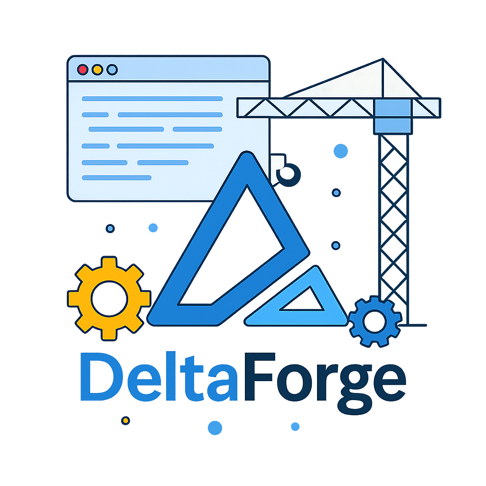

<p align="center">
  
</p>


# Development Guide

Use this guide to build, test, and extend DeltaForge. It covers local workflows, optional dependency containers, and how to work with Docker images.

All contributions are welcome and highly appreciated.

## Local prerequisites
- Rust toolchain 1.89+ (install via [`rustup`](https://rustup.rs)).
- Optional: Docker or Podman for running the dev dependency stack and the container image.

## Workspace layout
- `crates/deltaforge-core` : shared event model, pipeline engine, and checkpointing primitives.
- `crates/sources` : database CDC readers (MySQL binlog, Postgres logical replication) implemented as pluggable sources.
- `crates/processors` : JavaScript-based processors and support code for transforming batches.
- `crates/sinks` : sink implementations (Kafka producer, Redis streams) plus sink utilities.
- `crates/rest-api` : HTTP control plane with health/readiness and pipeline lifecycle endpoints.
- `crates/runner` : CLI entrypoint that wires the runtime, metrics, and control plane together.

Use these crate boundaries as reference points when adding new sources, sinks, or pipeline behaviors.

## Start dev dependencies
Bring up the optional backing services (MySQL, Kafka, Redis) with Docker Compose:

```bash
docker compose -f docker-compose.dev.yml up -d
```

Each service is exposed on localhost for local runs (`5432`, `3306`, `9092`, `6379`). The MySQL container seeds demo data from `./init-scripts` and configures binlog settings required for CDC.

Prefer the convenience `dev.sh` wrapper to keep common tasks consistent:

```bash
./dev.sh up     # start the dependency stack
./dev.sh down   # stop and remove it
./dev.sh ps     # see container status
```

## Build and test locally
Run the usual Rust workflow from the repo root:

```bash
cargo fmt --all
cargo clippy --workspace --all-targets --all-features
cargo test --workspace
```

Or use the helper script for a single command that mirrors CI expectations:

```bash
./dev.sh build         # build project (debug)
./dev.sh build-release # build project (release)
./dev.sh run           # run with examples/dev.yaml
./dev.sh fmt           # format code
./dev.sh lint          # clippy with warnings as errors
./dev.sh test          # full test suite
./dev.sh check         # fmt --check + clippy + tests (mirrors CI)
./dev.sh cov           # generate coverage report
```

## Docker images

### Use pre-built images

Multi-arch images (amd64/arm64) are published to GHCR and Docker Hub:

```bash
# Minimal (~57MB, scratch-based, no shell)
docker pull ghcr.io/vnvo/deltaforge:latest
docker pull vnvohub/deltaforge:latest

# Debug (~140MB, includes shell for troubleshooting)
docker pull ghcr.io/vnvo/deltaforge:latest-debug
docker pull vnvohub/deltaforge:latest-debug
```

| Variant | Size | Base | Use case |
|---------|------|------|----------|
| `latest` | ~57MB | scratch | Production |
| `latest-debug` | ~140MB | debian-slim | Troubleshooting, has shell |

### Build locally

Two Dockerfiles are provided:

```bash
# Minimal image (~57MB)
docker build -t deltaforge:local .

# Debug image (~140MB, includes shell)
docker build -t deltaforge:local-debug -f Dockerfile.debug .
```

Or use the dev helper:

```bash
./dev.sh docker            # build minimal image
./dev.sh docker-debug      # build debug image
./dev.sh docker-test       # test minimal image runs
./dev.sh docker-test-debug # test debug image runs
./dev.sh docker-all        # build and test all variants
./dev.sh docker-shell      # open shell in debug container
```

### Build multi-arch locally

To build for both amd64 and arm64:

```bash
./dev.sh docker-multi-setup  # create buildx builder (once)
./dev.sh docker-multi        # build both architectures
```

Note: Multi-arch builds use QEMU emulation and take ~30-35 minutes. The images are not loaded locally - use `--push` to push to a registry.

### Run the image

Run the container by mounting your pipeline specs and exposing the API and metrics ports:

```bash
docker run --rm \
  -p 8080:8080 -p 9000:9000 \
  -v $(pwd)/examples/dev.yaml:/etc/deltaforge/pipeline.yaml:ro \
  -v deltaforge-checkpoints:/app/data \
  ghcr.io/vnvo/deltaforge:latest \
  --config /etc/deltaforge/pipeline.yaml
```

Notes:

- The container listens on `0.0.0.0:8080` for the control plane API with metrics on `:9000`.
- Checkpoints are written to `/app/data/df_checkpoints.json`; mount a volume to persist them across restarts.
- Environment variables inside the YAML are expanded before parsing.
- Pass any other runner flags as needed (e.g., `--api-addr` or `--metrics-addr`).

### Debug a running container

Use the debug image to troubleshoot:

```bash
# Run with shell access
docker run --rm -it --entrypoint /bin/bash ghcr.io/vnvo/deltaforge:latest-debug

# Exec into a running container
docker exec -it <container_id> /bin/bash
```

## Dev helper commands

The `dev.sh` script provides shortcuts for common tasks:

```bash
./dev.sh help  # show all commands
```

### Infrastructure
```bash
./dev.sh up           # start MySQL, Kafka, Redis
./dev.sh down         # stop and remove containers
./dev.sh ps           # list running services
```

### Kafka
```bash
./dev.sh k-list                         # list topics
./dev.sh k-create <topic>               # create topic
./dev.sh k-consume <topic> --from-beginning
./dev.sh k-produce <topic>              # interactive producer
```

### Redis
```bash
./dev.sh redis-cli                      # open redis-cli
./dev.sh redis-read <stream>            # read from stream
```

### Database shells
```bash
./dev.sh pg-sh       # psql into Postgres
./dev.sh mysql-sh    # mysql into MySQL
```

### Documentation
```bash
./dev.sh docs        # serve docs locally (opens browser)
./dev.sh docs-build  # build docs
```

### Pre-release checks
```bash
./dev.sh release-check  # run all checks + build all Docker variants
```

## Contributing

1. Fork the repository
2. Create a branch from `main` (e.g., `feature/new-sink`, `fix/checkpoint-bug`)
3. Make your changes
4. Run `./dev.sh check` to ensure CI will pass
5. Submit a PR against `main`