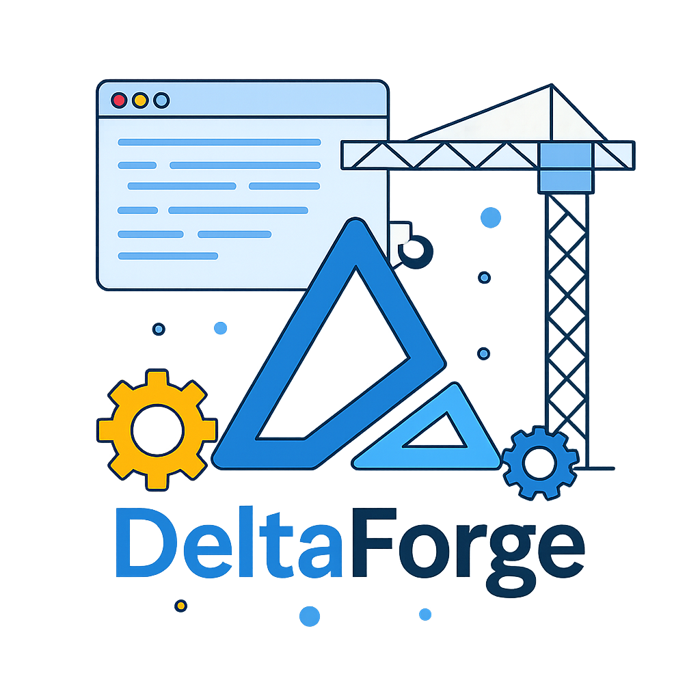

<p align="center">
  
</p>


# Development Guide

Use this guide to build, test, and extend DeltaForge. It covers local workflows, optional dependency containers, and how to work with Docker images.

All contributions are welcome and highly appreciated.

## Local prerequisites
- Rust toolchain 1.89+ (install via [`rustup`](https://rustup.rs)).
- Optional: Docker or Podman for running the dev dependency stack and the container image.

## Workspace layout
- `crates/deltaforge-core` : shared event model, pipeline engine, and checkpointing primitives.
- `crates/deltaforge-config` : YAML config parsing, environment variable expansion, and pipeline spec types.
- `crates/sources` : database CDC readers (MySQL binlog, Postgres logical replication) implemented as pluggable sources.
- `crates/processors` : JavaScript-based processors and support code for transforming batches.
- `crates/sinks` : sink implementations (Kafka producer, Redis streams, NATS JetStream) plus sink utilities.
- `crates/rest-api` : HTTP control plane with health/readiness and pipeline lifecycle endpoints.
- `crates/runner` : CLI entrypoint that wires the runtime, metrics, and control plane together.
- `crates/chaos` : end-to-end chaos scenario runner, benchmarks, and interactive playground UI.

Use these crate boundaries as reference points when adding new sources, sinks, or pipeline behaviors.

## Start dev dependencies
Bring up the optional backing services (MySQL, Kafka, Redis) with Docker Compose:

```bash
docker compose -f docker-compose.dev.yml up -d
```

Each service is exposed on localhost for local runs (`5432`, `3306`, `9092`, `6379`). The MySQL container seeds demo data from `./init-scripts` and configures binlog settings required for CDC.

Prefer the convenience `dev.sh` wrapper to keep common tasks consistent:

```bash
./dev.sh up     # start the dependency stack
./dev.sh down   # stop and remove it
./dev.sh ps     # see container status
```

## Build and test locally
Run the usual Rust workflow from the repo root:

```bash
cargo fmt --all
cargo clippy --workspace --all-targets --all-features
cargo test --workspace
```

Or use the helper script for a single command that mirrors CI expectations:

```bash
./dev.sh build         # build project (debug)
./dev.sh build-release # build project (release)
./dev.sh run           # run with examples/dev.yaml
./dev.sh fmt           # format code
./dev.sh lint          # clippy with warnings as errors
./dev.sh test          # full test suite
./dev.sh check         # fmt --check + clippy + tests (mirrors CI)
./dev.sh cov           # generate coverage report
```

## Docker images

### Use pre-built images

Multi-arch images (amd64/arm64) are published to GHCR and Docker Hub:

```bash
# Minimal (~57MB, scratch-based, no shell)
docker pull ghcr.io/vnvo/deltaforge:latest
docker pull vnvohub/deltaforge:latest

# Debug (~140MB, includes shell for troubleshooting)
docker pull ghcr.io/vnvo/deltaforge:latest-debug
docker pull vnvohub/deltaforge:latest-debug
```

| Variant | Size | Base | Use case |
|---------|------|------|----------|
| `latest` | ~57MB | scratch | Production |
| `latest-debug` | ~140MB | debian-slim | Troubleshooting, has shell |

### Build locally

Two Dockerfiles are provided:

```bash
# Minimal image (~57MB)
docker build -t deltaforge:local .

# Debug image (~140MB, includes shell)
docker build -t deltaforge:local-debug -f Dockerfile.debug .
```

Or use the dev helper:

```bash
./dev.sh docker            # build minimal image
./dev.sh docker-debug      # build debug image
./dev.sh docker-test       # test minimal image runs
./dev.sh docker-test-debug # test debug image runs
./dev.sh docker-all        # build and test all variants
./dev.sh docker-shell      # open shell in debug container
```

### Build multi-arch locally

To build for both amd64 and arm64:

```bash
./dev.sh docker-multi-setup  # create buildx builder (once)
./dev.sh docker-multi        # build both architectures
```

Note: Multi-arch builds use QEMU emulation and take ~30-35 minutes. The images are not loaded locally - use `--push` to push to a registry.

### Run the image

Run the container by mounting your pipeline specs and exposing the API and metrics ports:

```bash
docker run --rm \
  -p 8080:8080 -p 9000:9000 \
  -v $(pwd)/examples/dev.yaml:/etc/deltaforge/pipeline.yaml:ro \
  -v deltaforge-checkpoints:/app/data \
  ghcr.io/vnvo/deltaforge:latest \
  --config /etc/deltaforge/pipeline.yaml
```

Notes:

- The container listens on `0.0.0.0:8080` for the control plane API with metrics on `:9000`.
- Checkpoints are written to `/app/data/df_checkpoints.json`; mount a volume to persist them across restarts.
- Environment variables inside the YAML are expanded before parsing.
- Pass any other runner flags as needed (e.g., `--api-addr` or `--metrics-addr`).

### Debug a running container

Use the debug image to troubleshoot:

```bash
# Run with shell access
docker run --rm -it --entrypoint /bin/bash ghcr.io/vnvo/deltaforge:latest-debug

# Exec into a running container
docker exec -it <container_id> /bin/bash
```

## Dev helper commands

The `dev.sh` script provides shortcuts for common tasks:

```bash
./dev.sh help  # show all commands
```

### Infrastructure
```bash
./dev.sh up           # start MySQL, Kafka, Redis
./dev.sh down         # stop and remove containers
./dev.sh ps           # list running services
```

### Kafka
```bash
./dev.sh k-list                         # list topics
./dev.sh k-create <topic>               # create topic
./dev.sh k-consume <topic> --from-beginning
./dev.sh k-produce <topic>              # interactive producer
```

### Redis
```bash
./dev.sh redis-cli                      # open redis-cli
./dev.sh redis-read <stream>            # read from stream
```

### Database shells
```bash
./dev.sh pg-sh       # psql into Postgres
./dev.sh mysql-sh    # mysql into MySQL
```

### Documentation
```bash
./dev.sh docs        # serve docs locally (opens browser)
./dev.sh docs-build  # build docs
```

### Pre-release checks
```bash
./dev.sh release-check  # run all checks + build all Docker variants
```

## Chaos testing

End-to-end resilience tests and benchmarks run against a live Docker Compose stack with fault injection via [Toxiproxy](https://github.com/Shopify/toxiproxy). Scenarios cover network partitions, sink outages, crash recovery, server failover, schema drift, binlog purge, long-running endurance runs, and binlog backlog drain benchmarks.

### Prerequisites

Build the debug image first (includes a shell, needed for some scenarios):

```bash
docker build -t deltaforge:dev-debug -f Dockerfile.debug .
```

### Stack profiles

The `df` compose profile starts 3 DeltaForge instances — one per build variant:

| Instance | Port | Image | Use case |
|----------|------|-------|----------|
| `deltaforge-release` | 8080 | `deltaforge:latest` | Production behavior, regression testing |
| `deltaforge-debug` | 8081 | `deltaforge:dev-debug` | Verbose logging, assertions, chaos scenarios |
| `deltaforge-profile` | 8082 | `deltaforge:dev-profile` | Flamegraphs, CPU profiling, benchmarks |

Pipeline configs are selected dynamically — either via the chaos UI config dropdown, or the CLI `--port` flag. All 3 instances start with a default config (`mysql-to-kafka.yaml`) and can be swapped at runtime.

### Start the chaos environment

```bash
docker compose -f docker-compose.chaos.yml \
  --profile base --profile mysql-infra --profile kafka-infra --profile df up -d
```

Add `--profile pg-infra` if testing PostgreSQL scenarios.

### Run resilience scenarios

```bash
# Target the debug instance (default --port 8080, override with --port)
cargo run -p chaos -- --scenario all --source mysql
cargo run -p chaos -- --scenario network-partition --port 8081
cargo run -p chaos -- --scenario all --source postgres --port 8080
```

Exit code is `0` on full pass, `1` on any failure — suitable for CI.

### Run endurance and benchmark scenarios

Before running soak/drain, apply the appropriate config via the UI or REST API:

```bash
# Apply soak config to the profile instance (for flamegraphs)
curl -X POST http://localhost:7474/api/apply-config \
  -H 'Content-Type: application/json' \
  -d '{"port": 8082, "config": "mysql-soak.yaml"}'

# Soak — long-running with random fault injection
cargo run -p chaos -- --scenario soak --port 8082 --topic chaos.soak

# Soak-stable — same workload, no faults (baseline)
cargo run -p chaos -- --scenario soak-stable --port 8082 --topic chaos.soak --duration-mins 30

# Backlog-drain — measures catch-up throughput (1M row replay)
cargo run -p chaos -- --scenario backlog-drain --port 8082 --topic chaos.soak --no-proxy

# Backlog-drain with custom tuning
cargo run -p chaos -- --scenario backlog-drain --port 8082 --topic chaos.soak --no-proxy \
  --drain-max-events 4000 --drain-max-ms 100 \
  --drain-kafka-conf linger.ms=0

# TPC-C — apply tpcc config first, then run
curl -X POST http://localhost:7474/api/apply-config \
  -H 'Content-Type: application/json' \
  -d '{"port": 8081, "config": "mysql-tpcc.yaml"}'
cargo run -p chaos -- --scenario tpcc --port 8081 --duration-mins 30
```

### Avro encoding tests

```bash
# Unit + mock tests (no Docker needed)
cargo test -p sinks --test avro_encoding_tests

# Real Schema Registry integration tests (Docker, needs kafka-infra for SR)
cargo test -p sinks --test avro_encoding_tests -- --include-ignored --nocapture --test-threads=1

# Avro chaos scenario: apply Avro config, then run SR outage
curl -X POST http://localhost:7474/api/apply-config \
  -H 'Content-Type: application/json' \
  -d '{"port": 8081, "config": "mysql-to-kafka-avro.yaml"}'
cargo run -p chaos -- --scenario sr-outage --port 8081

# JSON vs Avro throughput comparison:
# Instance 1 (debug): JSON soak
curl -X POST http://localhost:7474/api/apply-config \
  -H 'Content-Type: application/json' \
  -d '{"port": 8081, "config": "mysql-soak.yaml"}'
cargo run -p chaos -- --scenario soak-stable --port 8081 --topic chaos.soak --duration-mins 30

# Instance 2 (profile): Avro soak
curl -X POST http://localhost:7474/api/apply-config \
  -H 'Content-Type: application/json' \
  -d '{"port": 8082, "config": "mysql-soak-avro.yaml"}'
cargo run -p chaos -- --scenario soak-stable --port 8082 --topic chaos.soak.avro --duration-mins 30
```

Compare in Grafana: `rate(deltaforge_sink_events_total[1m])` by instance port.

See [Performance Tuning](performance.md) for detailed throughput optimization guidance and profiling instructions.

### Playground UI

The chaos binary also ships an interactive web UI for manual exploration:

```bash
cargo run -p chaos -- --scenario ui
# Open http://localhost:7474
```

The UI provides:
- **Live service status** with health dots, port badges, and Docker image selector
- **Stale image detection** — warns when a container is running an older image after a rebuild
- **Activity bar** — shows current operation with per-button loading state and task history
- **Console log** — unified output for all actions (infra, faults, scenarios) with smart auto-scroll
- **One-click fault injection** via Toxiproxy (partitions, latency, bandwidth throttle)
- **Scenario runner** with proxy bypass toggle, drain settings, and live log streaming
- **Pipeline API browser** for any DeltaForge instance
- **Config Lab** for A/B config comparison with presets
- **CPU profiler** — captures flamegraphs from running containers with pipeline context in the subtitle

#### Data management

The UI includes a **Data Management** card for resetting persistent state between test runs:

- **Reset Checkpoints** — stops all DeltaForge instances and deletes their SQLite checkpoint databases (GTID positions, replication offsets). Source databases and Kafka are untouched. Use this when switching branches or after a binlog purge leaves stale checkpoint state.
- **Reset All Volumes** — runs `docker compose down -v` across all profiles, removing every named volume (MySQL data, Kafka state, Postgres data, checkpoints, Grafana). Full clean slate that requires re-initialization of all services.

### Teardown

```bash
docker compose -f docker-compose.chaos.yml --profile app down -v
docker compose -f docker-compose.chaos.yml down -v
```

See [`crates/chaos/README.md`](../../crates/chaos/README.md) for the full scenario catalogue, network topology, all CLI flags, and instructions for adding new scenarios.

## Contributing

1. Fork the repository
2. Create a branch from `main` (e.g., `feature/new-sink`, `fix/checkpoint-bug`)
3. Make your changes
4. Run `./dev.sh check` to ensure CI will pass
5. Submit a PR against `main`


## Things to Remember

### Tests
There a few `#[ignore]` tests, run them when making deep changes to the sources, pipeline coordination and anything with impact on core functionality.

### Logging hygiene

- Include `pipeline`, `tenant`, `source_id`/`sink_id`, and `batch_id` fields on all warnings/errors to make traces joinable in log aggregation tools.
- Normalize retry/backoff logs so they include the attempt count and sleep duration; consider a structured `reason` field alongside error details for dashboards.
- Add info-level summaries on interval (e.g., every N batches) reporting batches processed, average batch size, lag, and sink latency percentiles pulled from the metrics registry to create human-friendly breadcrumbs.
- Add metrics in a backward-compatible way: prefer new metric names over redefining existing ones to avoid breaking dashboards. Validate cardinality (bounded label sets) before merging.
- Gate noisy logs behind levels (`debug` for per-event traces, `info` for batch summaries, `warn`/`error` for retries and failures).
- Exercise the new metrics in integration tests by asserting counters change when sending synthetic events through pipelines.