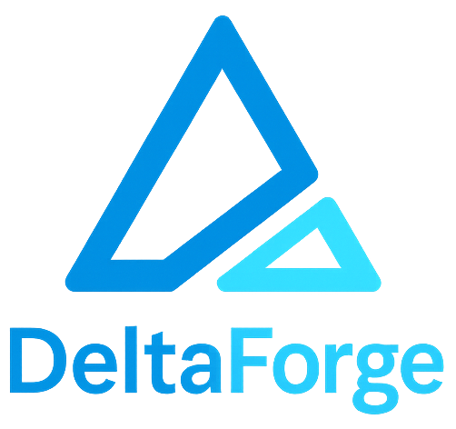

<p align="center">
  
  <br><br>
  <a href="https://github.com/vnvo/deltaforge/releases">
    
  </a>
  
  
</p>

# Introduction

DeltaForge is a modular, config-driven [Change Data Capture](cdc.md) (CDC) micro-framework built in Rust. It streams database changes into downstream systems like Kafka, Redis, and NATS while giving you full control over how each event is processed.

Pipelines are defined declaratively in YAML, making it straightforward to onboard new use cases without custom code.

<table>
  <tr>
    <td align="center" width="140">
      <b>Built with</b>
    </td>
    <td align="center" width="140">
      <b>Sources</b>
    </td>
    <td align="center" width="140">
      <b>Processors</b>
    </td>
    <td align="center" width="140">
      <b>Sinks</b>
    </td>
  </tr>
  <tr>
    <td align="center">
      
      <br><sub>Rust</sub>
    </td>
    <td align="center">
      
      
      <br><sub>MySQL · PostgreSQL</sub>
    </td>
    <td align="center">
      
      <br><sub>JavaScript</sub>
    </td>
    <td align="center">
      
      
      
      <br><sub>Kafka · Redis · NATS</sub>
    </td>
  </tr>
</table>

## Why DeltaForge?

### Core Strengths

- ⚡ **Powered by Rust** : Predictable performance, memory safety, and minimal resource footprint.
- 🔌 **Pluggable architecture** : Sources, processors, and sinks are modular and independently extensible.
- 🧩 **Declarative pipelines** : Define sources, transforms, sinks, and commit policies in version-controlled YAML with environment variable expansion for secrets.
- 📦 **Reliable checkpointing** : Resume safely after restarts with at-least-once delivery guarantees.
- 🛠️ **Cloud-native ready** : Single binary, Docker images, JSON logs, Prometheus metrics, and liveness/readiness probes for Kubernetes.


### Schema Intelligence

- 🔍 **Schema sensing** : Automatically infer and track schema from event payloads, including deep inspection of nested JSON structures.
- 🏷️ **Schema fingerprinting** : SHA-256 based change detection with schema-to-checkpoint correlation for reliable replay.
- 🗃️ **Source-owned semantics** : Preserves native database types (PostgreSQL arrays, MySQL JSON, etc.) instead of normalizing to a universal type system.

### Operational Features

- 🔄 **Automatic reconnection** : Exponential backoff with jitter for resilient connections.
- 🎯 **Flexible table selection** : Wildcard patterns (`db.*`, `schema.prefix%`) for easy onboarding.
- 📀 **Transaction boundaries** : Optionally keep source transactions intact across batches.
- ⚙️ **Commit policies** : Control checkpoint behavior with `all`, `required`, or `quorum` modes across multiple sinks.

## Use Cases

DeltaForge is designed for:

- **Real-time data synchronization** : Keep caches, search indexes, and analytics systems in sync.
- **Event-driven architectures** : Stream database changes to Kafka or NATS for downstream consumers.
- **Lightweight ETL** : Transform and route data without heavyweight infrastructure.

> **DeltaForge is _not_ a DAG-based stream processor.** It is a focused CDC engine meant to replace tools like Debezium when you need a lighter, cloud-native, and more customizable runtime.

## Getting Started

| Guide | Description |
|-------|-------------|
| [Quickstart](quickstart.md) | Get DeltaForge running in minutes |
| [CDC Overview](cdc.md) | Understand Change Data Capture concepts |
| [Configuration](configuration.md) | Pipeline spec reference |
| [Development](development.md) | Build from source, contribute |

## Quick Example

```yaml
metadata:
  name: orders-to-kafka
  tenant: acme

spec:
  source:
    type: mysql
    config:
      dsn: ${MYSQL_DSN}
      tables: [shop.orders]

  processors:
    - type: javascript
      inline: |
        (event) => {
          event.processed_at = Date.now();
          return [event];
        }

  sinks:
    - type: kafka
      config:
        brokers: ${KAFKA_BROKERS}
        topic: order-events
```

## Installation

**Docker (recommended):**

```bash
docker pull ghcr.io/vnvo/deltaforge:latest
```

**From source:**

```bash
git clone https://github.com/vnvo/deltaforge.git
cd deltaforge
cargo build --release
```

See the [Development Guide](development.md) for detailed build instructions and available Docker image variants.

## License

DeltaForge is dual-licensed under [MIT](https://github.com/vnvo/deltaforge/blob/main/LICENSE-MIT) and [Apache 2.0](https://github.com/vnvo/deltaforge/blob/main/LICENSE-APACHE).